## 导学

- 适合人群

项目经验->实习

应届毕业生->毕设

在职人员->更新技术栈

- 项目优势

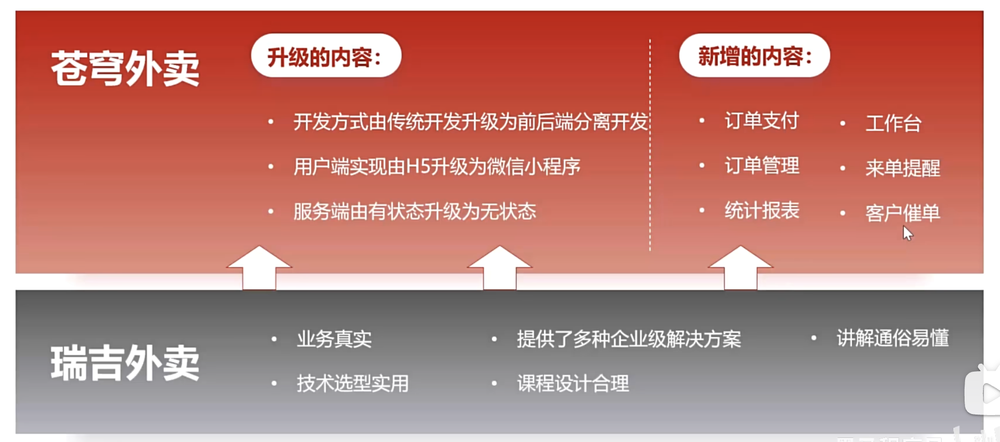

- 模块化开发

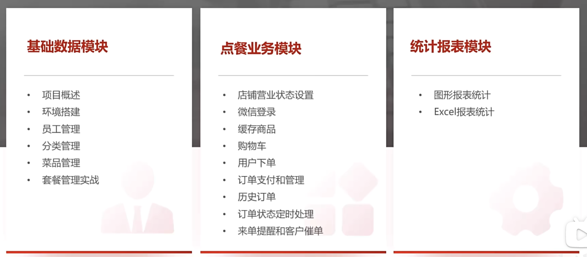

- 收获

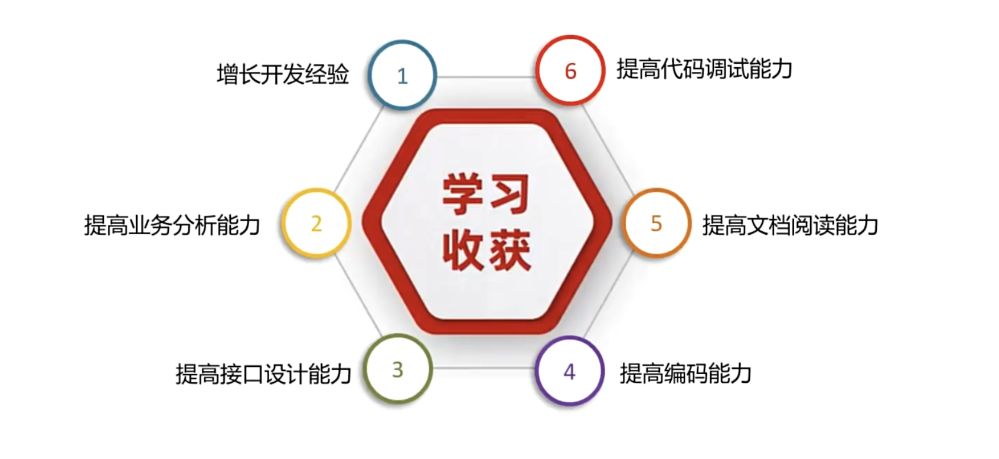

- 软件开发流程

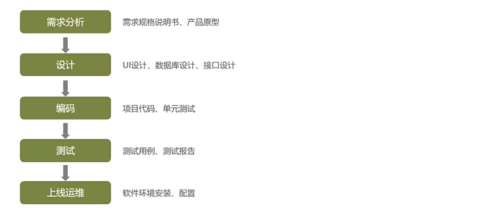

- 软件角色分工

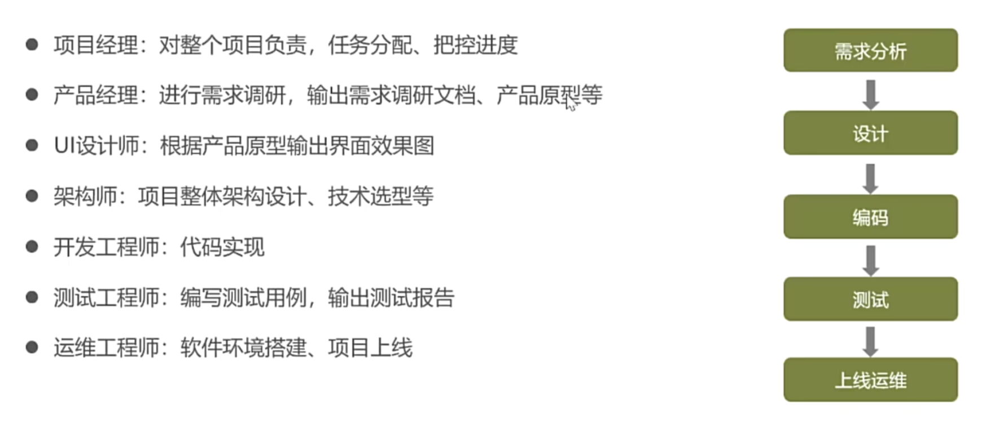

- 软件环境

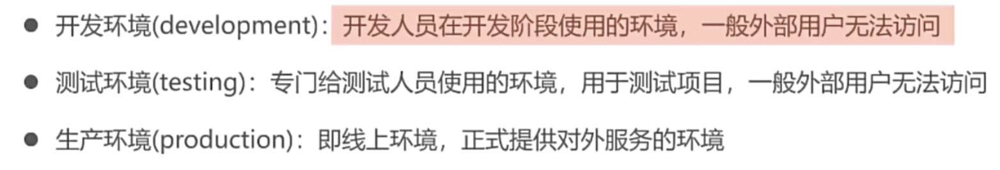

- 技术选型

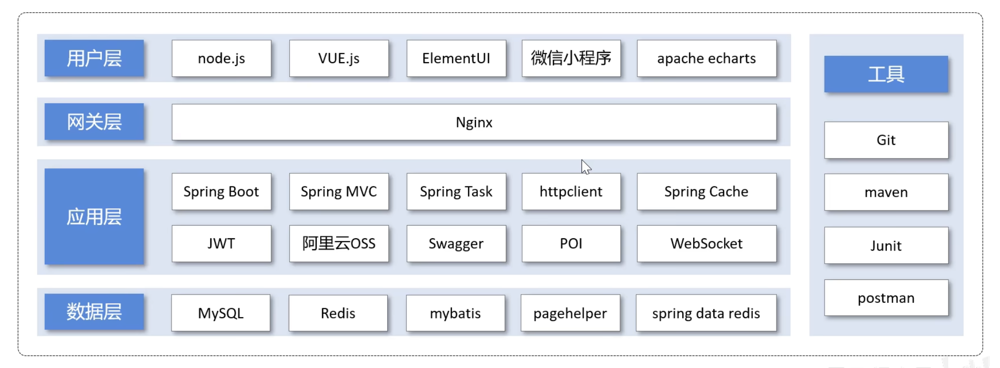

## 1.环境配置

### 前端配置

- 启动nginx代理服务器代理即可

### 后端配置

- 项目结构

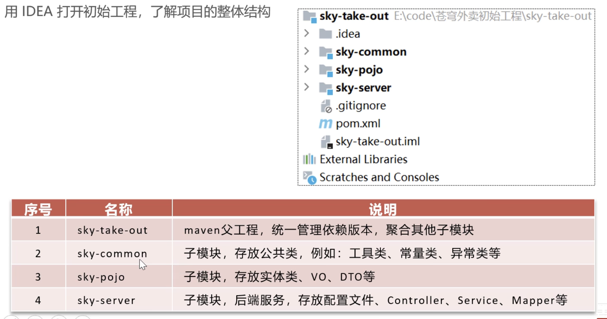


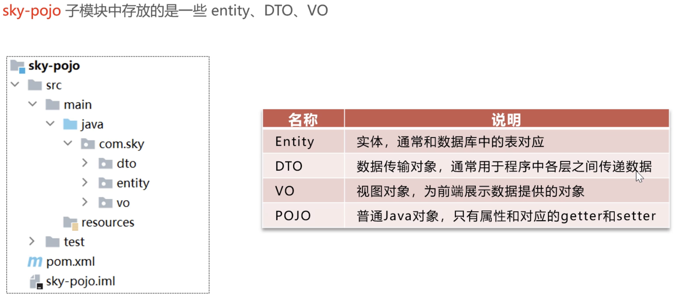

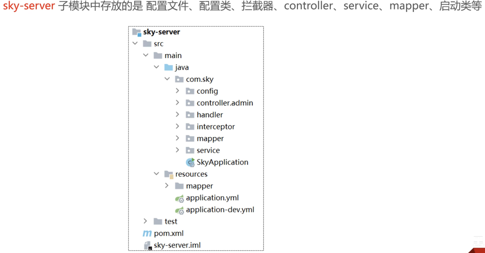

- 数据库设计

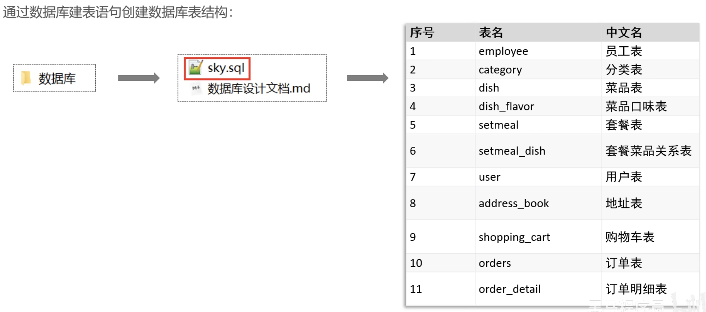

- 前后端联调

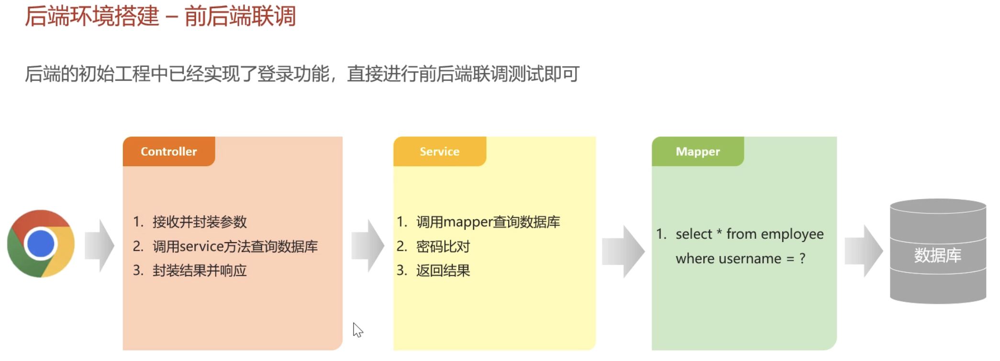

> 调试查看一个前端登陆请求是如何跳转的。

- API不一致问题

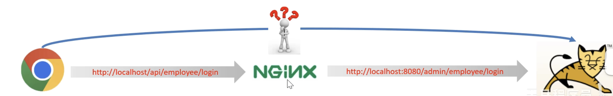

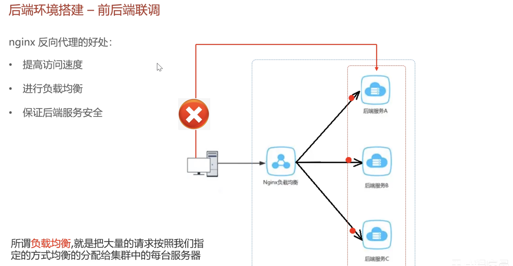

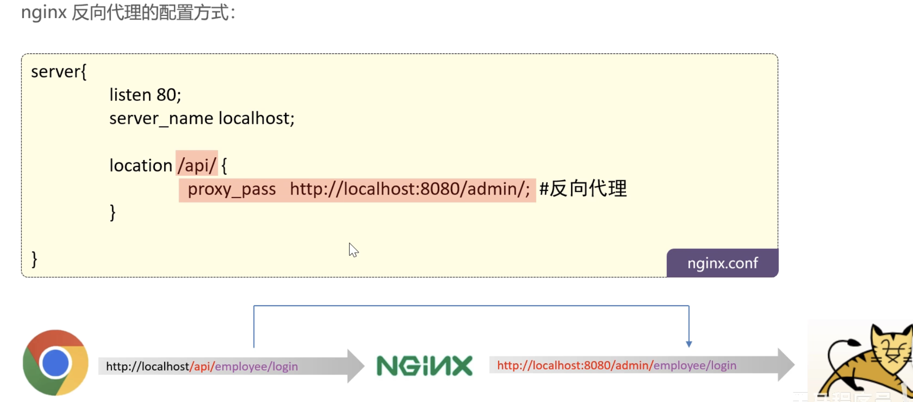

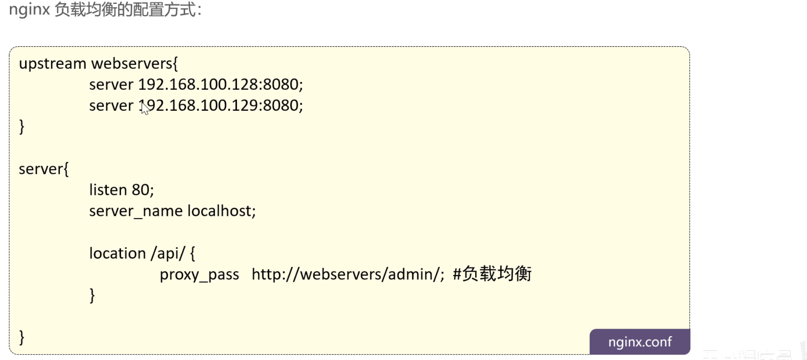

### 完善登陆功能

1. 修改数据库中的密码，改为MD5加密之后的密文
2. 修改Java代码，前端提交的密码进行MD5加密之后再跟数据库中密码对比

```java
password= DigestUtils.md5DigestAsHex(password.getBytes());
```

### 接口文档

- 开发流程

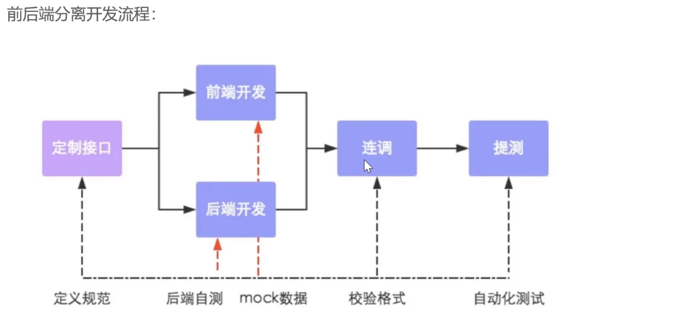

- Swegger使用

导入依赖

```xml
<!--knife4j-->
<dependency>
    <groupId>com.github.xiaoymin</groupId>
    <artifactId>knife4j-spring-boot-starter</artifactId>
</dependency>
```

> localhost:8080/doc.html

打开即可查看，具体配置查看项目的`package com.sky.config`。

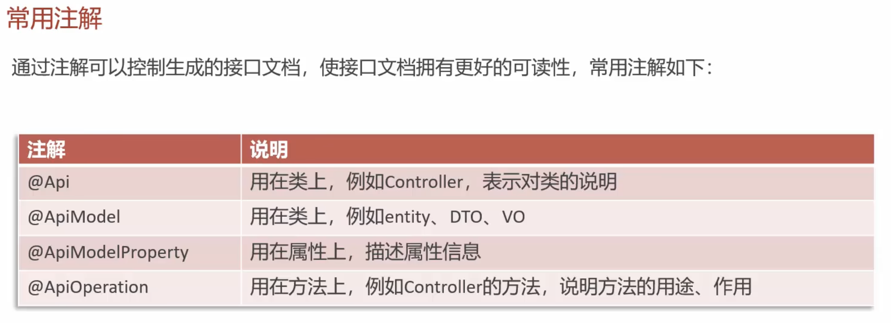

这几种Api形式可以查看：

```
EmployeeLoginDTO.java
EmployeeLoginVO.java
```

## 2.员工管理

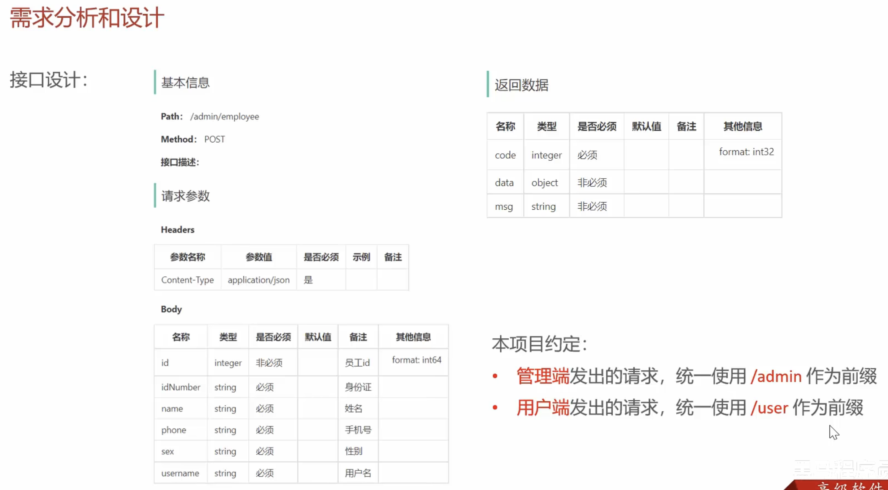

### 新增员工

创建接口：修改EmployeeController --> 数据转换：DTO->VO --> 利用持久层mapper：编写SQL代码

大概就是这么个逻辑，不过注意JWT拦截器，Swegger测试需要对用token处理

### 代码完善

1. 用户名重复异常处理
2. 新增员工的创建人id和修改人id需要完善