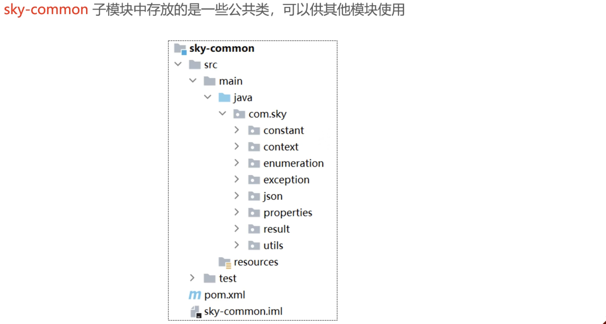
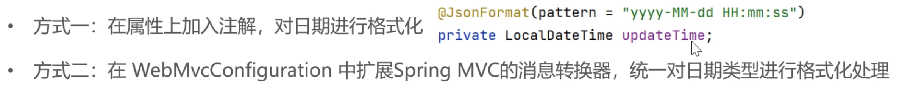
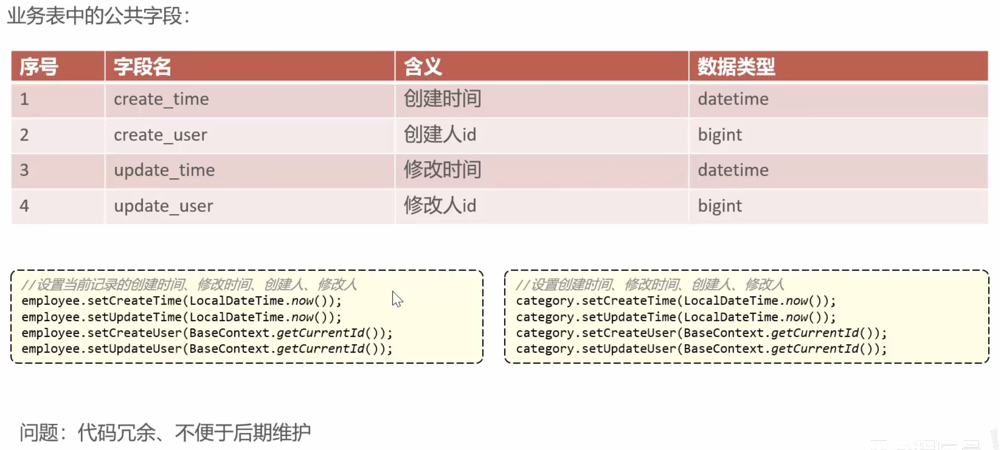

## 导学

- 适合人群

项目经验->实习

应届毕业生->毕设

在职人员->更新技术栈

- 项目优势


- 模块化开发


- 收获


- 软件开发流程


- 软件角色分工


- 软件环境


- 技术选型


## 1.环境配置

### 前端配置

- 启动nginx代理服务器代理即可

### 后端配置

- 项目结构





- 数据库设计


- 前后端联调


> 调试查看一个前端登陆请求是如何跳转的。

- API不一致问题


### 完善登陆功能

1. 修改数据库中的密码，改为MD5加密之后的密文
2. 修改Java代码，前端提交的密码进行MD5加密之后再跟数据库中密码对比

```java
password= DigestUtils.md5DigestAsHex(password.getBytes());
```

### 接口文档

- 开发流程


- Swegger使用

导入依赖

```xml
<!--knife4j-->
<dependency>
    <groupId>com.github.xiaoymin</groupId>
    <artifactId>knife4j-spring-boot-starter</artifactId>
</dependency>
```

> localhost:8080/doc.html

打开即可查看，具体配置查看项目的`package com.sky.config`。


这几种Api形式可以查看：

```
EmployeeLoginDTO.java
EmployeeLoginVO.java
```

## 2.员工管理


### 新增员工

#### 分析和设计

Control层创建接口：修改EmployeeController --> Service层数据转换：DTO->VO --> 利用持久层mapper：编写SQL代码

大概就是这么个逻辑，不过注意JWT拦截器，Swegger测试需要对用token处理

#### 代码完善

- 用户名重复异常处理

利用全局异常捕获器`GlobalExceptionHandler`获取异常，然后直接log和return->return利用Result范型类

- 新增员工的创建人id和修改人id需要完善


```java
package com.sky.interceptor;
```

查看`JwtTokenAdminInterceptor`这个拦截器或者生成JWT的代码能够更加深入理解JWT机制

想要向Service传递这个id，有点类似于前端的全局状态管理


```java
System.out.println("当前线程id: " + Thread.currentThread().getId());
```

可见，客户端的每次请求都是一个线程。客户端刷新，线程id++

定位到：`com.sky.context.BaseContext.java`，这里封装好了相关功能

> 通过线程传递修改人的id，该方法后续也能使用到

### 员工分页查询

#### 分析和设计

根据页码展示员工信息+每页展示10条数据+分页查询时，可根据需要进行姓名查询

> 将Query统一封装到PageResult

Control层创建接口：修改EmployeeController --> Service层创建接口实现：直接利用EmployeePageQueryDTO --> 利用持久层mapper：编写SQL代码

```java
// select * from employee limit 1, 10
// 如果这样做需要手动管理数据，借用Spring提供的插件PageHelper，底层原理是MyBatis对sql的limit结果进行拼接
```

通过MybatsX插件实现mapper到xml到映射警告，辅助编程

借助`PageHelper`

#### 代码完善

- 日期格式化



单一处理方式 vs 统一处理方式

借助`JsonFormat`和配置`WebMvcConfiguration`

### 启用禁用员工账号

```java
public Result startOrStop(@PathVariable Integer status, Long id) // 注意这里@PathVariable获取路径参数
```

| 参数名称 | 参数说明 | 请求类型 | 是否必须 | 数据类型       |
| :------- | :------- | :------- | :------- | :------------- |
| status   | status   | path     | true     | integer(int32) |
| id       | id       | query    | false    | integer(int64) |

### 根据id查询员工信息

稍微比较简单

Control层创建接口：修改EmployeeController --> Service层创建接口实现：直接利用Employee--> 利用持久层mapper：编写SQL代码

### 编辑员工账号

利用之前的启用禁用员工信息是创建的动态SQL

### 菜品分类

业务规则：

- 分类名称必须是唯一的
- 分类分为“菜品分类“和”套餐分类“
- 新增分类为禁用状态

接口：

- 新增分类
- 分类分页查询
- 根据ID删除分类
- 修改分类
- 启用/禁用分类
- 根据类型查询分类

> 代码逻辑和员工管理几乎一致，跳过

## 3.菜品管理

### 公共字段管理




